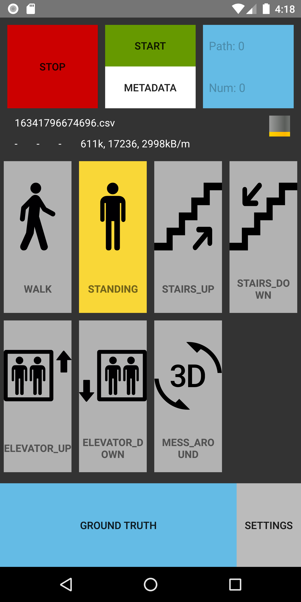

# SensorReadoutApp
Simple Android-App for the collection of sensor data, Wifi-Scans, Bluetooth-Scans, and Wifi RTT.

Additionally to the collection of raw sensor data, the app also allows the user to do manual tagging within the data, such as the currently performed activity, or "ground truth" points, which allow to map a recording to a certain pre-defined path.



---
## File-Format:
The file format used by the application is based on events.
Each incomming sensor value is mapped to its corresponding EventId, and logged to the csv-like file using the components:
- Nano-Timestamp (original timestamp reported by the Android sensor subsystem)
- EventId
- Dynamic amount of parameters, separated by the csv-separator

For a list of EventIds and their meaning, have a look at `SensorType.java`.

### Example:
```csv
0;-2;Wed Apr 08 15:35:20 GMT+02:00 2020;Markus;FHWS
0;50;STANDING;1
51272330;0;-0.30166942;4.3526587;8.734048
51272330;3;0.064983115;-0.23649593;0.16192514
56328330;0;-0.34955344;4.343082;8.456321
56328330;3;0.064983115;-0.23223473;0.15872924
56328330;1;-0.112231635;0.048184782;9.805753
56328330;2;-0.23463176;4.2904096;-1.3455414
61368330;0;-0.22505496;4.4101195;8.121132
61368330;3;0.06604841;-0.21732058;0.14807628
61368330;12;0.1907712;-0.15619373;-0.6493728;0.71935177
66408330;0;-0.20111294;4.486734;7.896077
66408330;3;0.064983115;-0.17790459;0.1384886
66408330;12;0.19772942;-0.16232795;-0.6445509;0.72045046
66408330;18;0.2370983;-0.09607227;-0.40076905
66408330;1;-0.20620692;4.8463116;8.52272
66408330;2;0.0047884034;-0.35913026;-0.62249243
```

| Nano Timestamp | EventId | Arg0 | Arg1 | Arg2 | Arg3 | ... |
|:--------------:|:-------:|:----------------------------------:|:-----------:|:-----------:|:----------:|-----|
| 0 | -2 | Wed Apr 08 15:35:20 GMT+02:00 2020 | Markus | FHWS |  |  |
| 0 | 50 | STANDING | 1 |  |  |  |
| 51272330 | 0 | -0.30166942 | 4.3526587 | 8.734048 |  |  |
| 51272330 | 3 | 0.064983115 | -0.23649593 | 0.16192514 |  |  |
| 56328330 | 1 | -0.112231635 | 0.048184782 | 9.805753 |  |  |
| 56328330 | 2 | -0.23463176 | 4.2904096 | -1.3455414 |  |  |
| 61368330 | 3 | 0.06604841 | -0.21732058 | 0.14807628 |  |  |
| 61368330 | 12 | 0.1907712 | -0.15619373 | -0.6493728 | 0.71935177 |  |
| 66408330 | 0 | -0.20111294 | 4.486734 | 7.896077 |  |  |
| 66408330 | 12 | 0.19772942 | -0.16232795 | -0.6445509 | 0.72045046 |  |
| 66408330 | 18 | 0.2370983 | -0.09607227 | -0.40076905 |  |  |

---
## Supported Sensors:
- Accelerometer
- Gravity
- Linear Acceleration (without Gravity)
- Gyroscope
- MagneticField
- Pressure
- Orientation (New / Old)
- Rotation Matrix
- Wifi (Access-Point advertisements with RSSI)
- Bluetooth (Beacon Advertisements with RSSI)
- Relative Humidity
- Rotation Vector
- Light
- Ambient Temperature
- GPS
- Wifi RTT
- Game Rotation Vector
- EddystoneUID (with sent UUID)
- DecawaveUWB
- StepDetector

---
## Supported User-Tagging
Additionally to the collection of sensor values, the app also supports some functions for user-tagging of the data while recording.

### Currently performed activity
The application allows the user to tag the activity he is currently performing.
The full set of currently supported activities is:
- Walking
- Standing
- Stairs Up
- Stairs Down
- Elevator Up
- Elevator Down
- Messing Around
- Ground-Truth points

### Ground-Truth points
If the path to walk is pre-defined, it can be helpful to mark certain "key-points" of "ground-truth" points on the floor, so the user can tell the app when he passed such a point.

This allows to map a recording onto the pre-defined path later on, by matching the key-points and interpolating between them.
